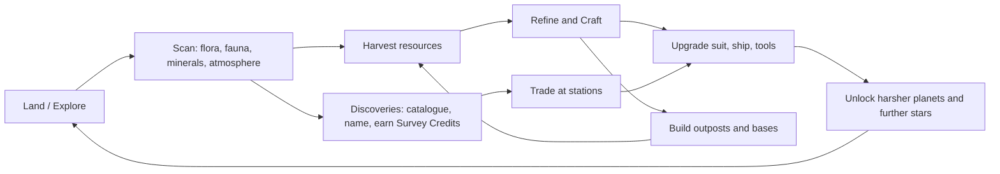
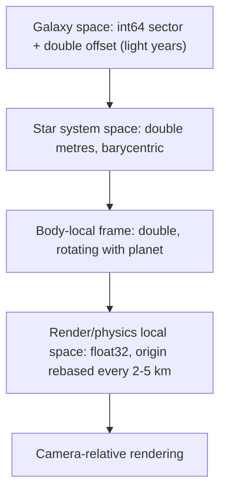
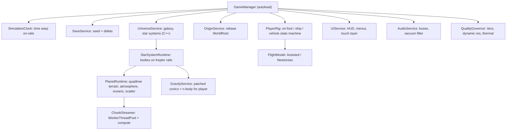
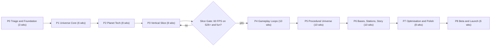

# Solar Horizon Roadmap

### From "LEO flight sim prototype" → hyper‑realistic, seamless space‑exploration game (No Man's Sky‑class) for Desktop + Samsung Galaxy S26+

---

## Overhaul Progress

- **Phase 0 — Triage & Foundation (Current)**
  - [~] Godot upgrade + import fix (Upgrade to Godot 4.7.2-stable, fix scene UIDs, clean imports)
  - [~] Repo hygiene (archive Python tools to `tools/legacy/`, mockups to `concept_mockups/`, add `.gdignore`)
  - [~] Input map (comprehensive cross-platform mappings for flight, on-foot, and touch)
  - [~] Docs rewrite (honest README, master overhaul roadmap, engineering guidelines)
  - [ ] Automated headless CI test pipeline (`tools/validate.ps1`, `tests/run_tests.gd`)
  - [ ] Android export profiling baseline on Samsung Galaxy S26+

- **Phase 1 — Universe Core (In Progress)**
  - [~] Universe core (`DVec3`, `UniversePosition`, `GameScale`, `SimulationClock`, `OriginService`)
  - [~] Keplerian orbital mechanics propagation & `CelestialBodyDef` astronomical data
  - [ ] `solar_core` GDExtension skeleton (C++20 godot-cpp for noise, orbital propagation, and terrain math)
  - [ ] `GravityService` with patched-conics propagation and SOI transition triggers
  - [ ] Physics interpolation enabled; camera controller moved to `_process`
  - [ ] Dual-tier flight model refactor (`FlightModel`: Assisted and Newtonian)

- **Phase 2 — Planet Technology**
  - [ ] Quadtree cube-sphere + CDLOD + skirts + geomorphing
  - [ ] GPU compute shader heightmap and normal generation
  - [ ] Local CPU collision patches near physics bodies (`HeightMapShape3D`)
  - [ ] Precomputed Hillaire atmosphere LUTs + aerial perspective froxels
  - [ ] Terrain splat shader with `Texture2DArray` and horizon ambient occlusion
  - [ ] GPU scatter pass (MultiMesh instances + octahedral impostors)

- **Phase 3 — Vertical Slice (Gate)**
  - [ ] One hero procedural planet + Earth/Moon onboarding tutorial path
  - [ ] On-foot controller (walk, sprint, jetpack, mining laser, visor scanner)
  - [ ] Life support survival systems and planetary hazards (thermal, radiation)
  - [ ] Explorer HUD + mobile touch controls v1
  - [ ] Save/load system (world seed + delta persistence)
  - [ ] **Slice Gate:** 60 FPS sustained for 30 minutes on Exynos 2600 S26+

- **Phase 4 — Gameplay Loops**
  - [ ] Full inventory grid, resource refining, crafting, and technology tree
  - [ ] Suit and ship component upgrade progression
  - [ ] Discovery catalogue, planetary scanning taxonomy, and survey contracts
  - [ ] Procedural flora v2 and fauna v1 (assembled part kits + procedural locomotion)
  - [ ] Dynamic weather and atmospheric storms

- **Phase 5 — Procedural Universe**
  - [ ] Galaxy generator (stellar classification, physically derived planetary compositions)
  - [ ] Hyperdrive warp transition sequence
  - [ ] Galaxy and star system navigation map
  - [ ] Real-star catalogue skybox
  - [ ] Procedural water bodies and oceans (FFT on desktop, Gerstner on mobile)

- **Phase 6 — Bases, Stations, Story**
  - [ ] Outpost construction (modular snap grid, power and oxygen grids, terrain deformation stamps)
  - [ ] Modular orbital space stations and trade factions
  - [ ] "Horizon Signal" narrative mission arc
  - [ ] Pro Flight certification (interactive maneuver nodes, aerobraking heat)
  - [ ] Light tactical space combat

- **Phase 7 — Optimisation & Polish**
  - [ ] Adaptive thermal governor (ADPF / ThermalHeadroom)
  - [ ] Pipeline shader baker coverage and asset pre-warming
  - [ ] ASTC texture audit and memory diet (≤ 3.5 GB RSS)
  - [ ] Accessibility (color-blind modes, control remapping) and haptic feedback

- **Phase 8 — Beta & Launch**
  - [ ] Closed beta testing (Google Play Internal & Steam Playtest)
  - [ ] Crash reporting and analytics integration
  - [ ] Storefront certification and 1.0 release

---

## 0. Executive Summary

**Where the project is today:** a small **Godot 4.3 / GDScript** prototype (~1,500 LOC, 13 scripts, 6 shaders, 4 scenes). It has a 50 km "toy" Earth sphere, a ship rigid body with simple gravity and drag, a HUD full of telemetry, and some loose systems that aren't hooked up (orbital maths, floating origin, terrain generator, solar map, rocket). The legacy README describes a lot more fidelity than the code delivers. The "hyperrealistic" screenshots are **software‑rasterised Python/PIL mockups** (`render_hyperrealistic_suite.py`), not captures from the engine. No `.import` files and no `.godot/` cache exist, so the prototype was never run in the editor.

**Where it needs to go:** a seamless universe game. You fly from space down to a planet surface with no loading screens. Planets are procedural with biomes, flora and fauna. The core loop is survival → gather → craft → upgrade → explore further, plus base building and stations, all wrapped in **"plausible science" realism**: real astronomy, real light, real orbital maths as an optional layer. It must run at **60 FPS sustained on a Galaxy S26+** and scale up to high‑end PCs.

**Strategy in one sentence:** keep the brand and identity (Adelaide Base, real Sol system, orbital mechanics flavour) and the small amount of reusable maths and UX. **Rebuild the core around a double‑precision universe model, a quadtree planet renderer, a LUT‑based atmosphere and a data‑driven gameplay layer.** Prove it with a **single‑planet vertical slice on the S26+** before widening scope.

> [!IMPORTANT]
> The biggest risk is scope, not tech. No Man's Sky launched with a team of about 15 after years of work. This plan is built around a **vertical slice gate** (≈ month 6). Do not start procedural galaxies, base building or fauna until one planet looks great and runs at 60 FPS on the S26+.

---

## 1. Current‑State Audit

### 1.1 Inventory

| Area | Files | Size | State |
|---|---|---|---|
| Engine config | [project.godot](project.godot) | 107 lines | Godot 4.3, Forward+ (desktop), Mobile (mobile), keyboard‑only input map |
| Scenes | `world.tscn`, `ship.tscn`, `rocket.tscn`, `solar_map.tscn`, `ui/hud.tscn` | small | Only `world` → `ship` + `hud` is wired. `rocket` and `solar_map` are orphans |
| Scripts | 13 `.gd` files | ~1,500 LOC | Mix of working, faked and unwired |
| Shaders | 6 `.gdshader` | ~16 KB | Earth surface/clouds/atmosphere rim, sky, plume, lunar |
| Models | 10 planet `.obj` files (~9 MB, UV spheres) + 5 vessel `.obj` files | ~10 MB | Planet OBJs unused. Vessels are procedural primitives made by Python |
| Textures | 5 Earth maps (2048×1024) + 4 tiny orbiter maps | ~2 MB | Low resolution for close range |
| Tooling | 3 Python scripts (numpy/PIL) | ~76 KB | OBJ generators + mockup renderer |
| Docs | README, ROADMAP | | Legacy roadmap was sim‑focused (KSP/Orbiter‑like), not game‑focused |

### 1.2 Critical findings (ranked)

| # | Severity | Finding | Evidence |
|---|---|---|---|
| 1 | 🔴 Critical | **Three conflicting world scales.** The ship uses a 50 km Earth with `g=9.81`. `SolarSystemData` and `TrajectoryRenderer` use real metres (6,371 km, real μ). The HUD uses a third hard‑coded `μ=490.5`, `r=50 km` | [ship_flight_controller.gd](scripts/ship_flight_controller.gd), [hud.gd](scripts/hud.gd), [solar_system_data.gd](scripts/solar_system_data.gd) |
| 2 | 🔴 Critical | **HUD orbital values are faked.** Ap/Pe come from `pow(v_ratio, 1.8)` heuristics, inclination is hard‑coded to "51.6°", and G‑force is guessed from throttle | [hud.gd](scripts/hud.gd) |
| 3 | 🔴 Critical | **Floating origin isn't used anywhere, and it isn't double precision.** `universe_origin_offset` is a float32 `Vector3`, despite the comment. Shifting RigidBodies via `global_transform` can also break contacts | [floating_origin.gd](scripts/floating_origin.gd) |
| 4 | 🔴 Critical | **No real planet surface.** Earth is a `SphereMesh` (256×128) with a 2K texture. The terrain generator is unused, makes 6 static 16×16 faces with no LOD, and calls `get_image()` **per vertex**, which is extremely slow | [world.tscn](scenes/world.tscn), [nasa_terrain_generator.gd](scripts/nasa_terrain_generator.gd) |
| 5 | 🟠 High | **Time warp uses `Engine.time_scale` up to 10,000×**, which makes physics explode and tunnelling certain | [solar_map_view.gd](scripts/solar_map_view.gd) |
| 6 | 🟠 High | **Shaders light surfaces twice.** They compute N·L by hand into `ALBEDO` while still using a lit render mode, and they use a `sun_direction` uniform instead of the real light. The atmosphere is a fresnel rim hack, not scattering | [lunar_surface.gdshader](shaders/lunar_surface.gdshader), [earth_atmosphere.gdshader](shaders/earth_atmosphere.gdshader) |
| 7 | 🟠 High | **Rocket assumes a flat world** (`altitude = global_position.y`) and has no scene integration | [rocket_flight_controller.gd](scripts/rocket_flight_controller.gd) |
| 8 | 🟠 High | **Body data can't place planets in their orbits.** It lacks longitude of ascending node, argument of periapsis and mean anomaly at epoch | [solar_system_data.gd](scripts/solar_system_data.gd) |
| 9 | 🟡 Medium | **The camera updates in `_physics_process`**, so it will judder on 120 Hz displays like the S26+. No physics interpolation | [camera_controller.gd](scripts/camera_controller.gd) |
| 10 | 🟡 Medium | **Wasteful AA stack:** MSAA 2× + FXAA + TAA all on together, plus a 4096 shadow atlas. Bad for mobile | [project.godot](project.godot) |
| 11 | 🟡 Medium | **Keyboard only.** The legacy README promised gamepad bindings, but none existed | [project.godot](project.godot) |
| 12 | 🟡 Medium | **Invalid scene UIDs** (`uid://world_scene_01`). Godot will regenerate or warn | scene headers |
| 13 | 🟢 Low | Junk files: `test.tres`, `test.txt`, `test_write.gd`. No `.gitignore` | — |
| 14 | 🟢 Low | **No game layer at all:** no menus, saving, audio, inventory, missions or onboarding | — |

### 1.3 File‑by‑file verdict

| File | Verdict | Reason / Action |
|---|---|---|
| `orbital_mechanics.gd` | ♻️ **Keep maths, port** | The state‑vector → elements code is sound. Port it to C++ (GDExtension), use doubles, and add Kepler propagation (solve M→E→ν) |
| `solar_system_data.gd` | ♻️ **Keep data, restructure** | Convert to `CelestialBodyDef` Resources (`.tres`) and add the full Keplerian elements at J2000 |
| `trajectory_renderer.gd` | ♻️ **Keep concept** | Move it into Map View space and drive it from patched‑conic predictions |
| `virtual_joystick.gd` | ♻️ **Keep, extend** | Add a floating origin point, multi‑touch ownership and dead‑zone curves |
| `ship_flight_controller.gd` | 🔁 **Refactor** | Split into `ShipController` + `FlightModel` strategies (Assisted / Newtonian). Remove the hard‑coded Earth |
| `camera_controller.gd` | 🔁 **Refactor** | Add on‑foot first‑ and third‑person modes, a camera‑shake service, `_process` + physics interpolation |
| `hud.gd` / `hud.tscn` | 🔁 **Replace** | A minimal Explorer HUD plus an optional "Sim Overlay" that keeps the telemetry identity, with real values |
| `floating_origin.gd` | 🆕 **Rewrite** | Double‑precision universe coordinates and a sector‑based rebase of a single `WorldRoot` |
| `nasa_terrain_generator.gd` | 🆕 **Replace** | Quadtree cube‑sphere planet system (C++ + compute shader) |
| `earth_environment.gd` | 🆕 **Replace** | `StarSystemRuntime` drives the sun direction, body rotation and atmosphere parameters |
| `solar_map_view.gd` | 🆕 **Rewrite** | System + Galaxy map. Time warp runs on the simulation clock, not `Engine.time_scale` |
| `rocket_flight_controller.gd` / `rocket.tscn` | 📦 **Archive** | Bring back later as an optional "launch from Adelaide" mission |
| Shaders (surface/atmosphere/clouds/lunar) | 🆕 **Replace** | Terrain splat shader, Hillaire LUT atmosphere, layered/volumetric clouds |
| `space_sky.gdshader` | ♻️ **Evolve** | Derive the stars from the galaxy star catalogue so the sky matches the player's position |
| `engine_plume.gdshader` | ♻️ **Keep, improve** | Add atmospheric back‑pressure expansion and a vacuum plume |
| Planet `.obj` files (9 MB) | 🗑️ **Delete** | Procedural spheres replace them |
| Vessel `.obj` files | 📦 **Placeholder** | Re‑author in Blender and export to glTF 2.0 with LODs |
| Python generators / renderer | 📦 **Move to `/tools/legacy`** | Replace with a Blender/glTF pipeline. Rename the screenshots folder to `concept_mockups/` |
| README / ROADMAP | 🔁 **Rewrite** | Describe the actual state honestly. This plan supersedes ROADMAP |

---

## 2. Vision & Design Pillars

**Elevator pitch:** *"No Man's Sky meets real astronomy."* You start at Adelaide Base on a real Earth in a real Sol system. You find the **Horizon Drive** and leave for a procedurally generated galaxy that obeys physics. Every star, planet colour, sky tint and biome follows from plausible science.

| Pillar | Meaning | Test |
|---|---|---|
| **1. Breathtaking & believable** | Physically based light, atmosphere and scale. Realistic, not stylised | A screenshot could pass as concept art for a sci‑fi film |
| **2. Seamless** | Space → orbit → atmosphere → surface → cave → base with no loading screens | Fly from orbit and land without a single hitch over 33 ms |
| **3. Curiosity is the engine** | Every planet has something to discover, scan, name or harvest | Within 60 s of landing, the player has at least 3 points of interest in view |
| **4. Science as a superpower, not homework** | Orbital maths, spectra and hazards are optional mastery layers | The game is finishable in Assisted mode. Newtonian mode is extra depth |
| **5. Pocketable** | Full experience on an S26+ in 10–20 minute sessions | Cold start to playing in under 15 s. Autosave at every meaningful step |

### 2.1 How we differ from No Man's Sky (our selling points)
- **The real Sol system** as the home and tutorial: Earth, Moon, Mars, Europa and Titan at a compressed but faithful scale, using public‑domain NASA data.
- **Physically derived procedural generation:** star class → luminosity → habitable zone → equilibrium temperature → atmosphere → sky colour (Rayleigh from composition) → biome → flora palette.
- **An optional Pro Flight layer:** a real orbital map, maneuver nodes, aerobraking and re‑entry heating. This builds on what the current project already wanted to be.
- **Science Scanner gameplay:** spectroscopy of atmospheres and minerals, and a catalogue of discoveries with real taxonomy flavour.

---

## 3. Game Design

### 3.1 Core loops



| Loop | Duration | Content |
|---|---|---|
| Moment‑to‑moment | 10–60 s | Walk, jetpack, scan, mine, dodge hazards, fly low over terrain |
| Session (mobile‑friendly) | 10–20 min | Visit 1–2 planets, finish a survey contract, craft an upgrade, autosave |
| Mid‑term | Hours | Unlock a hazard tier (heat, cold, toxic, radiation), new ship class, base modules |
| Long‑term | Tens of hours | Story arc ("Horizon Signal"), galaxy core journey, fleet, discovery collection |

### 3.2 Systems backlog (MoSCoW)

| System | Priority | Notes |
|---|---|---|
| Seamless planet landing + on‑foot exploration | **Must** | Core fantasy |
| Ship flight: **Assisted** (NMS‑like) + **Newtonian** (pro) | **Must** | Assisted: auto‑level, hover, landing assist, pulse drive. Newtonian: reuse the orbital work |
| Scanner & discovery catalogue | **Must** | Visor scan ping, highlights, entries, naming |
| Survival: life support + hazard protection | **Must** | Real hazards: temperature from star distance and albedo, radiation from magnetosphere and flares, toxic atmospheres |
| Resources, refining, crafting, tech tree | **Must** | Data‑driven (`Resource`‑based recipes) |
| Inventory (suit, ship, base storage) | **Must** | Touch‑friendly grid |
| Save / load (seed + deltas) + cloud save | **Must** | Google Play Games / Steam Cloud |
| Procedural flora & minerals | **Must** | GPU scatter, biome rules |
| Procedural fauna (assembled + procedural animation) | Should | Part kits + IK. Hard budget on mobile |
| Star systems + hyperdrive warp | Should | Galaxy seeded from 64‑bit coordinates |
| Space stations, NPC trade, contracts | Should | One modular station kit, recoloured per faction |
| Base building (snap modules) | Should | Grid and snap points, power and oxygen networks |
| Pro Flight: orbit map, maneuver nodes, re‑entry heat | Should | Our differentiator |
| Light space combat (pirates / drones) | Could | Keep it simple, ship‑to‑ship |
| Weather & storms (dust, ice, acid rain) | Could | Gameplay hazard + visuals |
| Freighter / capital ship | Could | Later |
| Multiplayer (co‑op) | Won't (v1) | Keep the data model deterministic and authority‑ready |

### 3.3 First 15 minutes (onboarding)
1. **Adelaide Base at dawn** (real location, which keeps the brand). Walk‑and‑talk tutorial: scanner, interact, suit.
2. **Assisted launch to orbit** in the starter shuttle (reworking the existing orbiter). Cinematic re‑entry FX teaser.
3. **Moon landing:** first low‑gravity on‑foot play, first resource gathering, first crafting (fix a beacon).
4. **The Horizon Signal:** an anomaly on the far side gives you the Horizon Drive → first warp → first procedural system.
5. From here the open game starts. Pro Flight mode unlocks as an optional "certification".

### 3.4 Game‑feel principles
- **Assisted flight by default.** Physically motivated (thrust, inertia) but with hidden assists: auto‑stabilise, terrain avoidance, soft landing. Newtonian mode is a toggle.
- **Juice:** camera shake, FOV kick on boost, haptics (the S26+ has a strong linear actuator), layered audio, screen‑space heat haze.
- **Readability:** high‑contrast highlights on scan targets, a clear hazard meter, a minimal diegetic HUD. The existing telemetry wall becomes an opt‑in "Sim Overlay".
- **Pacing:** no mandatory long transits. Pulse drive between planets in 30–90 s. Planets rotate and orbit slowly enough to notice but not to frustrate.

---

## 4. Technical Architecture

### 4.1 Engine & language decisions

| Decision | Recommendation | Rationale |
|---|---|---|
| Engine | **Godot 4.7.2-stable**. Upgrade from 4.3 | Jolt physics built in (4.4+), **3D physics interpolation** (4.4+), ubershaders / pipeline precompilation, **shader baker** to remove compile stutter on Android, SMAA and stencil buffer, AgX tonemapper |
| Precision | **Stock float32 engine + custom double‑precision universe layer** | `precision=double` builds need custom export templates for every platform, including Android, plus custom GDExtension builds. Floating origin + double sim state gives 95% of the benefit |
| Hot paths | **C++ GDExtension (godot‑cpp)** | Terrain generation, noise, quadtree, orbit propagation, scatter rules. GDScript is around 10–50× too slow for per‑vertex work |
| GPU work | **RenderingDevice compute shaders** | Heightmaps, normals, scatter placement, atmosphere LUTs. Works on both the Forward+ and Mobile renderers (Vulkan) |
| Gameplay | **GDScript (statically typed)** | Iteration speed. Data‑driven via `Resource` classes |
| C# | Avoid | Android support is still the weakest path |
| Renderers | Desktop: **Forward+**. S26+: **Mobile** (Vulkan). Optional desktop "Low" on Mobile renderer | Core shaders must compile and look correct on both. CI tests both |
| Physics | **Jolt** + custom gravity, planets on rails | Rigid bodies exist only in a local bubble around the player |

### 4.2 Coordinate system & scale



- **`UniversePosition`** = `{sector: Vector3i, offset: double×3}`. Sim state lives in C++ / GDScript `float` (which is 64‑bit). Godot `Vector3` is used only for local render space.
- **Rebase** a single `WorldRoot` node when the player is more than 2 km (mobile) / 5 km (desktop) from the origin. Use `PhysicsServer3D` body teleports and reset physics interpolation on rebase.
- **Body‑fixed frame** when near the surface (below about 2× atmosphere height). The player moves with the rotating planet, so there's no "planet sliding underneath" jitter. Switch to the inertial frame in space.
- **Game scale (recommended):** planets at **≈1:10 radius** (Earth ≈ 637 km, as KSP's 600 km Kerbin proves is fun) with real surface gravity. Orbital velocity ≈ 2.5 km/s, so reaching orbit takes minutes. **Interplanetary distances compressed about 1:100+**, plus a pulse drive. This is a design parameter, not hard‑coded.

> [!NOTE]
> At 637 km radius, float32 precision near the planet surface is about 6 cm. That's fine for rendering only because of the rebase. Never store absolute positions in `Vector3`.

### 4.3 Runtime structure



### 4.4 Planet rendering (the hardest technical item)

| Layer | Technique | Desktop | S26+ |
|---|---|---|---|
| Geometry | **Cube‑sphere quadtree, CDLOD** with geomorphing and skirts. One shared grid mesh per patch, displaced in the vertex shader from a height texture | 65×65 patches, depth about 18 | 33×33 patches, about 16 levels, tighter split distance |
| Height generation | Compute shader: domain‑warped FBM + ridged noise + erosion approximation + crater stamps. Biome masks from temperature/humidity/latitude | Full | Same algorithm, fewer octaves at distance |
| Real Sol bodies | NASA DEMs (MOLA, LOLA, SRTM/GEBCO) as the low‑frequency base + procedural detail | Up to 8K base | 4K base, ASTC |
| Collision | CPU (C++) `HeightMapShape3D` patches only within about 1 km of physics bodies | 3×3 patches | 3×3 patches |
| Materials | Triplanar on steep slopes, **Texture2DArray** splat (8–16 layers), height‑blend, macro variation | 2K layers, parallax occlusion | 1K layers, no POM, ASTC 6×6 |
| Terrain editing | **Heightfield deformation stamps** (dig and flatten for bases), stored as save deltas | ✓ | ✓ |
| Caves | Authored cave modules at entrance markers (instanced interiors) | ✓ | ✓ |
| Oceans | FFT waves + foam + shoreline depth fade | FFT 256 | Gerstner × 4, no refraction |

> [!WARNING]
> **Voxel versus heightmap** is a key decision. Voxels (for example Zylann's godot_voxel) allow NMS‑style tunnels and overhangs. They need a custom engine build and cost more memory and battery. The plan recommends **heightmap + stamps + authored caves** for the S26+ budget. See Open Decisions.

### 4.5 Atmosphere, sky, lighting

- **Atmosphere:** Hillaire 2020 LUT method (transmittance LUT, multi‑scattering LUT, sky‑view LUT, aerial‑perspective froxels). Parameters come from planet composition. It scales well to mobile, where LUTs update at low resolution and are amortised over frames.
- **Clouds:** desktop uses raymarched volumetric clouds with temporal reprojection. The S26+ uses 2–3 parallax cloud layers plus a low‑resolution (¼) raymarch only below the cloud deck. From orbit, both use a cloud shell texture with self‑shadowing.
- **Lighting:** one directional sun (real stellar colour temperature). Ambient comes from the atmosphere LUT (irradiance). Desktop: SSAO/SSIL, contact shadows, volumetric fog. **The Mobile renderer has no SSAO, SSR, SDFGI or volumetric fog**, so on mobile realism comes from **terrain horizon AO baked in compute**, good PBR textures, specular occlusion and fog driven by the atmosphere LUT.
- **Space:** star catalogue skybox (real nearby stars from the HYG database + procedural galaxy). Eclipses, ring shadows and planetshine.
- **Tonemapping:** AgX or ACES, with physically based exposure (auto‑exposure with an EV range for vacuum versus surface).

### 4.6 Scatter, flora, fauna
- **GPU scatter:** a compute pass places instances per patch from biome rules → `MultiMesh` buffers. LOD chain: mesh LOD0–2 → octahedral impostor → fade out.
- **Fauna:** procedural assembly (body plan + part kits + palette) with procedural locomotion (IK feet, spine). Simple utility‑AI behaviours (graze, flee, territorial). **Active cap: 8 on mobile, 24 on desktop.**
- **Flora:** parametric templates with wind via vertex shader. No per‑instance physics.

### 4.7 Physics & simulation
- Planets and moons **on Kepler rails** (analytic). The player ship is integrated with **patched conics in space** and a full local physics model near the surface (Jolt).
- **Time warp:** physics is off in warp. The ship is propagated analytically on its conic. Warp drops out automatically near bodies, atmospheres and hazards.
- **Fixed physics tick at 60 Hz with 3D physics interpolation**, so 120 Hz rendering is smooth on the S26+.
- **Determinism:** all procedural generation is seeded and platform‑independent (integer hash noise in C++). Golden tests guarantee that the same seed gives the same planet on desktop and Android.

### 4.8 Data, saves, streaming
- **Seed hierarchy:** `galaxy_seed → sector → system → body → patch`. Nothing procedural is saved. Only **deltas** are saved: terrain edits, harvested nodes, bases, discoveries and inventory.
- **Save format:** versioned binary (or compressed JSON for debugging) with schema migration. Autosave on landing, take‑off, craft and every 2 minutes. Cloud sync.
- **Streaming:** `WorkerThreadPool` for CPU generation, compute dispatch budgeted to about 1.5 ms per frame on mobile, and a priority queue by screen‑space error. A hard cap on in‑flight jobs.

### 4.9 Proposed folder structure
```
/addons/solar_core/        # C++ GDExtension (universe, terrain, orbits, noise)
/game/
  autoload/                # GameManager, SimulationClock, SaveService, QualityGovernor
  core/                    # DVec3, UniversePosition, GameScale, OriginService
  universe/                # galaxy, star_system, celestial_body_def.gd (+ .tres data)
  planet/                  # quadtree, chunk, atmosphere, ocean, scatter
  player/                  # player_rig, on_foot, ship, flight_models/
  gameplay/                # inventory, crafting, scanning, survival, building, missions
  ui/                      # hud, menus, touch/, sim_overlay/
  audio/
/shaders/                  # terrain/, atmosphere/, clouds/, ocean/, fx/
/assets/                   # gltf/, textures/ (array sets), audio/
/data/                     # recipes, resources, biomes, factions (.tres)
/tools/                    # blender scripts, data import (NASA DEM → tiles), legacy/
/tests/                    # GUT/gdUnit tests, determinism goldens, perf scenes
```

---

## 5. Platform Constraints & Budgets

### 5.1 Samsung Galaxy S26+ (mobile baseline)

| Spec | Value | Implication |
|---|---|---|
| SoC (AU/EU/most regions) | **Exynos 2600, Xclipse 960 GPU** (AMD RDNA‑based) | Primary test device. AMD RDNA Vulkan architecture |
| SoC (US/CN/JP) | Snapdragon 8 Elite Gen 5, **Adreno 840** | Secondary test device. Different tiling/binning behaviour |
| RAM | 12 GB LPDDR5X | Android's low‑memory killer still limits a game to roughly **3–4 GB**. Budget **≤ 3.5 GB RSS** |
| Display | 6.7", 3120×1440, 120 Hz LTPO | Default system resolution is usually FHD+ (2340×1080). **Never render at native QHD+** |
| Storage | UFS 4.x, 256/512 GB | Fast streaming. Install size is limited by the store, not the device |
| Battery | 4,900 mAh | Target **≥ 2 h** play in 60 FPS mode |
| Thermals | Phone, no fan | Sustained GPU clocks drop to about **50–65 % of peak** after 10–20 min. **Budget for the throttled state, not the peak** |
| Input | Touch (high sampling rate), gyroscope, haptics, Bluetooth controllers | Touch first, gyro aim, controller as a first‑class option |

### 5.2 Mobile performance budget (S26+, "Performance 60" mode)

| Budget | Target |
|---|---|
| Frame time | 16.6 ms. **Aim for ≤ 12.5 ms average GPU** for thermal headroom |
| Internal render resolution | about 1560×720 → **FSR 1.0** upscale to 2340×1080 (dynamic 0.6–0.8 scale) |
| GPU split (ms) | Terrain 3.0 · Scatter/flora 2.5 · Atmosphere + clouds 2.0 · Shadows 1.5 · Ship/characters/FX 1.5 · Post + UI 1.0 · Headroom 1.0 |
| CPU main thread | ≤ 8 ms. Physics ≤ 2 ms. Generation on worker threads |
| Draw calls | ≤ 600 per frame (MultiMesh, shared grid mesh, texture arrays) |
| Visible triangles | ≤ 1.5 M |
| Texture memory | ≤ 1.2 GB, **ASTC** (6×6 colour, 4×4 normals) |
| Shadows | 2 cascades, 2048, sun only |
| Dynamic lights | ≤ 4 visible omni/spot lights (headlights, base lamps) |
| Shader compilation | **Zero runtime hitches.** Shader baker + ubershader fallback + pre‑warm during the splash screen |
| Install size | ≤ 2.5 GB. **AAB base ≤ 200 MB** + Play Asset Delivery or first‑launch download |
| Cold start | ≤ 15 s to gameplay. Resume from background ≤ 3 s |
| Thermal soak test | 30 min at the landing spot + flight. FPS stays ≥ 58 and the device remains comfortable to hold |

**Mobile‑specific requirements**
- **Thermal governor:** an Android plugin reading `PowerManager.getThermalHeadroom()` / the **ADPF** performance hints. It lowers render scale, scatter density and cloud steps *before* the OS throttles.
- **Modes:** *Performance* (60 FPS), *Fidelity* (30 FPS, higher scale and density), *Battery Saver* (30 FPS, 0.6 scale). Menus and map run at 120 Hz.
- **Safe areas:** respect `DisplayServer.get_display_safe_area()` (camera punch‑hole, gesture bar).
- **Touch layout:** left floating stick (move / pitch‑roll), right drag (look) + **gyro aim option**, contextual action cluster (scan, interact, jetpack/boost, mine), radial quick menu, minimum target size 48 dp, minimum text 12 sp.
- **Lifecycle:** pause, autosave and release GPU‑heavy resources on `NOTIFICATION_APPLICATION_PAUSED`.

### 5.3 Desktop tiers

| Tier | Example hardware | Target |
|---|---|---|
| Minimum | GTX 1060 6 GB / RX 580, 4‑core CPU, 8 GB RAM | 1080p30, Low (can use the Mobile renderer) |
| Recommended | RTX 3060 / RX 6600, 6‑core, 16 GB | 1080p60 High / 1440p60 with FSR 2 |
| Ultra | RTX 4070 Ti+ / RX 7900, 8‑core, 32 GB | 1440p–4K, volumetric everything, high scatter density |
| Bonus target | Steam Deck | Good bridge between mobile and desktop presets |

### 5.4 Graphics scalability matrix

| Feature | S26+ Battery | S26+ Perf 60 | S26+ Fidelity 30 | Desktop Low | Desktop High | Desktop Ultra |
|---|---|---|---|---|---|---|
| Renderer | Mobile | Mobile | Mobile | Mobile/Fwd+ | Forward+ | Forward+ |
| Render scale / upscaler | 0.6 FSR1 | 0.67 FSR1 (dynamic) | 0.85 FSR1 | 0.75 FSR1 | 1.0 / FSR2 Q | 1.0 TAA / native |
| Terrain patch / split | 33 / far | 33 / medium | 33 / near | 33 / medium | 65 / near | 65 / very near |
| Splat layers / POM | 4 / ✗ | 8 / ✗ | 8 / ✗ | 8 / ✗ | 16 / ✓ | 16 / ✓ |
| Scatter density | 25 % | 40 % | 60 % | 50 % | 100 % | 150 % |
| Clouds | Layers | Layers + ¼ raymarch | Layers + ½ raymarch | Layers | Volumetric | Volumetric HQ |
| Atmosphere LUT updates | per 8 frames | per 4 | per 2 | per 4 | every frame | every frame |
| Shadows | 1 cascade 1K | 2 × 2K | 2 × 2K | 2 × 2K | 4 × 4K + contact | 4 × 4K PCSS |
| AO / GI | baked horizon AO | baked horizon AO | baked horizon AO | SSAO low | SSAO + SSIL | SSAO + SSIL HQ |
| Reflections | sky probe | sky probe | sky probe | probe | SSR | SSR HQ |
| Volumetric fog | ✗ | ✗ (LUT fog) | ✗ (LUT fog) | ✗ | ✓ | ✓ HQ |
| Ocean | Gerstner 2 | Gerstner 4 | Gerstner 4 | Gerstner 4 | FFT 128 | FFT 256 |
| Active fauna | 4 | 8 | 8 | 12 | 24 | 32 |
| AA | FSR1 sharpen | FSR1 + SMAA* | FSR1 + SMAA* | FXAA | FSR2/TAA | TAA |

*\*Check SMAA performance on the Mobile renderer on both GPUs before committing.*

---

## 6. Content & Asset Pipeline

| Asset | Pipeline |
|---|---|
| Ships, stations, base modules | **Blender → glTF 2.0**, with LOD0–2 + collision hulls. Trim sheets + tiling materials for memory. Modular kits so variants are cheap |
| Terrain materials | CC0 scanned PBR sets (Poly Haven, ambientCG) → packed into Texture2DArray (albedo+height, normal+roughness+AO) → ASTC/BPTC per platform |
| Real bodies | NASA public‑domain imagery and DEMs (Blue Marble, LRO/LOLA, MOLA, Cassini) → `/tools` importer → cube‑face tiles |
| Fauna/flora | Part kits in Blender, procedural assembly in game, octahedral impostors baked in a tool |
| Audio | Layered engine loops, procedural wind and atmosphere, vacuum low‑pass bus, UI sounds. Optional FMOD GDExtension |
| UI | Vector icons, a single theme resource, light/dark HUD variants, localisation CSV from day one |

> [!CAUTION]
> Check every external asset's licence: CC0 preferred, and log attributions in `assets/LICENSES.md`. Retire the procedurally generated Python OBJs from shipping builds.

---

## 7. Phased Roadmap

Timeline assumes a **core team of 3–5** (2 engineers incl. 1 graphics/C++, 1 technical artist, 1 designer/artist, contracted audio). A solo developer should multiply the durations by about 2.5.



### Phase 0 — Triage & Foundation (≈ 3 weeks)
- [~] Upgrade to Godot 4.7.2-stable. Open the project, fix UIDs and imports, add `.gitignore`, delete junk files.
- [~] Rename `screenshots_hyperrealistic` → `concept_mockups`. Rewrite the README to match reality.
- [ ] Set up **CI**: headless import check, unit tests (`tests/run_tests.gd`), Android + Windows export on each merge.
- [ ] Get **both S26+ variants** (Exynos + Snapdragon) or use cloud device farms. Install profilers: Android GPU Inspector, Snapdragon Profiler, RenderDoc, Godot profiler.
- [~] Complete input map: keyboard and mouse, gamepad, touch. Set up the action layers.
- [ ] **Perf harness scene:** a fixed camera flythrough that logs frame time, GPU time, memory and temperature to CSV.
- **Exit:** a clean build runs on both phones, and perf telemetry works.

### Phase 1 — Universe Core (≈ 6 weeks)
- [ ] `solar_core` GDExtension skeleton (C++, godot‑cpp), built for Windows / Linux / Android arm64.
- [~] `UniversePosition`, `OriginService` (rebase), `SimulationClock` (on‑rails time warp).
- [~] `CelestialBodyDef` resources with full J2000 elements. Kepler propagation (port of `orbital_mechanics.gd`).
- [ ] `GravityService` with patched conics and SOI transitions. Real HUD values.
- [ ] Physics interpolation on, camera in `_process`. Ship flight refactored into `FlightModel` (Assisted + Newtonian).
- **Exit:** fly Earth orbit → Moon SOI → lunar orbit with zero jitter. Map orbit lines match the simulation.

### Phase 2 — Planet Technology (≈ 8 weeks)
- [ ] Quadtree cube‑sphere + CDLOD + skirts + morphing. Compute‑shader heights and normals.
- [ ] Collision patches near bodies. Chunk streamer with frame‑time budgeting.
- [ ] Hillaire atmosphere (LUTs) + aerial perspective. Cloud layers v1.
- [ ] Terrain splat shader with Texture2DArray. Horizon AO bake.
- [ ] GPU scatter v1 (rocks, grass, a single tree type) + impostors.
- **Exit:** orbit → touchdown on a procedural planet with no hitches over 33 ms. S26+ at 60 FPS at the landing site. Memory ≤ 3.5 GB.

### Phase 3 — Vertical Slice (≈ 8 weeks) → **GATE**
- [ ] One hero procedural planet + Earth/Moon tutorial path (first 15 minutes from §3.3).
- [ ] On‑foot controller (walk, sprint, jetpack), scanner v1, mining, a handful of resources, one crafting recipe chain.
- [ ] Life support and one hazard type. Explorer HUD + touch layout v1. Save/load (seed + deltas).
- [ ] Audio pass v1. Re‑entry FX. Re‑authored starter shuttle (glTF).
- [ ] **Playtests:** 10+ external testers, half of them on phones.
- **Gate criteria:** 60 FPS sustained for 30 minutes on Exynos S26+. Testers rate it "want to keep playing" ≥ 4/5. No game‑breaking bugs.

### Phase 4 — Gameplay Loops (≈ 10 weeks)
- Full inventory, refining, crafting and tech tree. Suit and ship upgrades. 4 hazard types. Discovery catalogue and naming. Survey contracts. Procedural flora v2. Fauna v1 (3 body plans). Weather v1.

### Phase 5 — Procedural Universe (≈ 10 weeks)
- Galaxy generator (star classes, physically derived planets), hyperdrive warp sequence, galaxy map, star catalogue skybox, biome families (lush, arid, frozen, toxic, scorched, radioactive, exotic), ring systems and moons, oceans (FFT/Gerstner).

### Phase 6 — Bases, Stations, Story (≈ 10 weeks)
- Snap‑build base modules, power and oxygen networks, terrain stamps. Modular space stations, NPC trade and factions. The "Horizon Signal" story arc. Pro Flight certification (maneuver nodes, aerobraking). Light combat.

### Phase 7 — Optimisation & Polish (≈ 8 weeks, plus continuous)
- Thermal governor tuning, shader baker coverage, memory diet, ASTC audit, accessibility (colour‑blind palettes, subtitles, remapping, hold‑to‑toggle), localisation, controller polish, haptics.

### Phase 8 — Beta & Launch (≈ 6 weeks)
- Closed beta (Play Console internal/closed tracks, Steam Playtest), crash reporting (Sentry or Firebase Crashlytics via plugin), store assets, ratings, launch.

**Indicative total:** about 18–20 months to 1.0 for the assumed team, with the vertical slice at about month 6.

---

## 8. Risk Register

| Risk | Likelihood | Impact | Mitigation |
|---|---|---|---|
| Scope creep (NMS is huge) | High | Critical | Vertical slice gate. MoSCoW backlog. Cut "Could" items without hesitation |
| Planet terrain tech takes longer than planned | High | High | Study existing references (Zylann's solar system demo, CDLOD papers). Timebox, and fall back to a simpler LOD |
| Exynos/Xclipse driver bugs | Medium | High | Exynos is the **primary** device. Weekly on‑device runs. Shader fallbacks |
| Thermal throttling after 15 minutes | High | High | Budget for throttled clocks, ADPF governor, 30‑minute soak test in CI |
| Shader compile stutter on Android | Medium | High | Godot shader baker + ubershaders + splash pre‑warm |
| Procedural sameness ("10,000 bowls of oatmeal") | Medium | High | Hand‑authored "points of interest" kits, rare anomalies, strong biome palettes and landmarks |
| Floating‑point / origin bugs | Medium | Medium | Single rebase authority, automated far‑travel tests (1 AU, 100 ly) |
| Determinism differences between platforms | Medium | Medium | Integer hash noise in C++, golden‑image and hash tests per platform |
| Save corruption / migrations | Low | High | Versioned schema, atomic writes, backup slots |
| Asset licensing | Low | High | CC0 policy, licence log |
| Team bandwidth (C++/graphics expertise) | Medium | High | Hire or contract a graphics engineer for P1–P2. Otherwise extend the timeline |

---

## 9. QA, Tooling & Metrics

- **Automated:** unit tests for orbital maths (compare against known ephemerides), determinism hashes per seed, save round‑trip tests, headless import, nightly Android build + perf flythrough on a device (or device farm).
- **Perf dashboards:** frame/GPU time percentiles (p50/p95/p99), hitches over 33 ms per minute, memory peak, temperature/headroom curves over 30 minutes, battery drain per hour.
- **Debug tools:** in‑game console, quadtree visualiser, chunk heatmap, origin‑rebase log, quality‑tier overrides, seed jump ("teleport to planet X").
- **Playtest KPIs:** time to first discovery under 3 minutes, session length, D1/D7 retention in beta, crash‑free sessions ≥ 99.5 %.

---

## 10. Immediate Next Steps (first 2 weeks)

1. Upgrade to Godot 4.7.2-stable. Open and import the project, fix errors and UIDs, add `.gitignore`, commit.
2. Delete `test.*`, archive unused planet OBJs and orphan scenes to `archive/` or `/tools/legacy`.
3. Rewrite the README to describe the actual state.
4. Add the Android export preset (arm64, Vulkan, ASTC). Deploy the current scene to an S26+ and record a baseline perf capture.
5. Fix the quick wins that de‑risk later work: one scale constant source, the AA settings, the camera moved to `_process` with physics interpolation, real HUD orbital values via `OrbitalMechanics`.
6. Spike (≤ 1 week): a minimal C++ GDExtension that builds for Android arm64 and returns noise samples. This proves the toolchain early.
7. Spike (≤ 1 week): a compute‑shader heightmap patch rendering on the S26+ Mobile renderer.

---

## 11. Open Decisions

| # | Decision | Options | Recommendation |
|---|---|---|---|
| 1 | Realism vs accessibility default | Assisted default + Newtonian toggle / Newtonian only | **Assisted default** |
| 2 | Planet scale | 1:10 (KSP‑like) / 1:20 / real 1:1 | **1:10 radius, compressed distances** |
| 3 | Terrain tech | Heightmap + stamps + authored caves / full voxel (custom engine build) | **Heightmap** for the mobile budget |
| 4 | Keep the real Sol system as the start | Yes (Adelaide Base brand) / fully fictional | **Yes** |
| 5 | Team & timeline | Solo / 3–5 core team / outsourcing | Affects all estimates |
| 6 | Business model | Premium / premium mobile + PC / F2P cosmetic | Premium fits the genre. F2P changes the design a lot |
| 7 | Multiplayer | Never / post‑launch co‑op | **Post‑launch co‑op**, deterministic and authority‑ready from day one |
| 8 | Minimum Android support beyond the S26+ | S26+ only / 2023+ flagships / wide mid‑range | 2023+ flagships (Adreno 740 / Xclipse 940 class) |
| 9 | Cross‑save desktop ↔ mobile | Yes / No | Yes. It affects the save and account design early |
