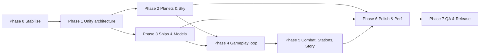

# Solar Horizon — Improvement Roadmap (Graphics · 3D Models · Gameplay · Bugs)

Companion to the product-level [`ROADMAP.md`](../ROADMAP.md). That file tracks *features by release phase*; this one is an **execution plan for subagents**, ordered by dependency, with scoped work packages (WPs), file ownership, and acceptance criteria.

Engine: Godot 4.7 (Forward+ / Mobile), Jolt, GDScript. Tests: `godot --headless --script tests/run_tests.gd`. Validation: `tools/validate.ps1`.

---

## 0. Decisions (locked)

- **CUT:** all combat (WP 5.4, `combat_system`, fighter model, B-08) and the "Horizon Signal" story (WP 5.7).
- **Scope order:** Earth (1:10 scale, radius ≈ 637 km) + Moon first. Other planets (non-Earth textures, Phase 5 procedural universe) start only after Earth/Moon pass their gates.
- **Ships:** hand-modelled in Blender (scripted via `blender --background --python` if no GUI), exported as `.glb`.
- **Subagents:** Gemini flash (high). Keep prompts scoped; agents read only their listed files.

## 1. Audit Summary (state of the repo)

### Architecture
Two parallel code bases coexist:

| Layer | Location | State |
|---|---|---|
| **Legacy prototype** | `scenes/world.tscn`, `scenes/ship.tscn`, `scripts/*`, `shaders/earth_*`, `shaders/lunar_surface` | What actually runs (`run/main_scene = world.tscn`). 50 km "toy" Earth sphere at `y=-50000`, `SphereMesh` planets, ship = one OBJ. |
| **New engine** | `game/**` (core, universe, planet, gameplay, ui, player), `shaders/{atmosphere,clouds,ocean,terrain,fx}` | Mostly **not wired into the main scene**. Many files are 500 B–3 KB stubs/skeletons. |

### Graphics / models
- `assets/models/planets/` is **empty**. Planets are runtime `SphereMesh` in `world.tscn` (Earth, Moon) with 2K textures; no Mars/Venus/Jupiter/Saturn rings/Titan/Europa visuals even though `.tres` body defs exist in `game/universe/data/bodies/`.
- Ships/stations: five `.obj` meshes (`spacecraft_orbiter`, `deep_space_cruiser_v2`, `lunar_lander_v2`, `crew_capsule_v2`, `space_station_v2`) generated by Python (`tools/legacy/generate_hyperrealistic_models.py`). Only the orbiter has PBR textures. OBJ has no LODs, no sockets, no animation, no collision.
- `scenes/prefabs/ship.tscn` is a CSG-primitive placeholder with `uid://ship_uid_placeholder`.
- Engine plume is a scaled `CylinderMesh`; atmosphere/clouds are shader hacks in the prototype, while Hillaire LUT atmosphere (`shaders/atmosphere/`) is a ~0.5 KB stub.
- `README` mock-ups in `concept_mockups/` are PIL renders, not in-engine.
- Directional light has `shadow_enabled = false`; sun is not a visible body in the main scene.

### Gameplay
- Core loop systems exist as thin scripts (`survival`, `scanner`, `crafting`, `inventory`, `trade`, `faction`, `contract`, `discovery`, `base_builder`, `power_network`, `combat`), **none connected to a player, scene, or UI** that runs. UI `.tscn` for inventory/discovery/orbit map/galaxy map exist without functional scripts (`touch_controls.gd` is 108 B).
- Only flight is playable: `scripts/ship_flight_controller.gd` + `hud.gd`. No objective, no progression, no landing → on-foot transition.

### Suspected bugs / defects (found by static reading — **each must be reproduced first**)

| ID | Severity | Location | Finding |
|---|---|---|---|
| B-01 | High | `scripts/ship_flight_controller.gd` (`_physics_process`, `_update_telemetry`) | `Engine.has_singleton("SimulationClock")` is false for autoloads (they are scene nodes, not engine singletons) → `sim_time` is always `0`, so orbital bodies/gravity never advance. Use `get_node_or_null("/root/SimulationClock")` or reference the autoload by name. |
| B-02 | High | `game/universe/gravity_service.gd` `gravity_accel` | Adds the **parent body's** attraction on top of the dominant body inside a patched-conic SOI — double counts gravity (and is not a valid non-inertial frame). Also `dominant_body` compares unscaled `mu` ratios while `gravity_accel` uses scaled `mu`; units inconsistent. |
| B-03 | High | `game/core/origin_service.gd` | Not in `[autoload]` but `PlanetRuntime` fetches `/root/OriginService`; `_shift_origin` shifts only direct children of `world_root` (nested/Jolt-owned nodes, trajectory lines, sky ignored); `RigidBody3D` shift via `PhysicsServer3D.body_set_state` skips velocity/interp correctness checks; `shift_vec` = full position of first offender (causes whole-world jumps when two nodes diverge). |
| B-04 | Med | `scripts/ship_flight_controller.gd` | `altitude_agl_m` is just ASL; `RadarAltimeter` ray (`-50000`) unused; landing detection `altitude <= 1.5` measured from planet *centre radius*, not terrain → ship "lands" inside mountains or floats above them once real terrain exists. `landed` also adds a fake support force instead of using collision. |
| B-05 | Med | `scripts/ship_flight_controller.gd` | Roll torque applied on `-basis.z` while pitch/yaw use fixed `x`/`y` basis; torque is not scaled by inertia → handling depends on mass/CoM. Air density model `exp(-h*7.5)` uses normalised height, not scale height. |
| B-06 | Med | `game/gameplay/inventory_system.gd` | `add_item` always returns `0`, no capacity/stack limits, keyed by `Resource` instance (breaks after save/load or `duplicate()`). |
| B-07 | Med | `game/gameplay/scanner_system.gd` | `interact` action toggles visor (input conflict with future interactions); looks up `/root/ScatterSystem` that does not exist. |
| B-08 | Med | `game/gameplay/combat_system.gd` | `_process` regen emits signal every frame; `apply_damage` ignores armor/overkill; `fire_laser` uses `Array[RID]` default (typed-array mutability) and no hit feedback. Not attached to ship. |
| B-09 | Med | `game/planet/spike/*` vs `game/planet/core/*` | Duplicate quadtree/noise/shader/GLSL code ("spike" never removed) – divergence risk. |
| B-10 | Low | `scripts/*.uid` | Orphan `.uid` files for deleted scripts (`floating_origin.gd`, `orbital_mechanics.gd`). |
| B-11 | Low | repo root | Untracked scratch files `calc_transform.gd`, `check_gulf.gd`, `test_sun.gd`; uncommitted shader/material edits. |
| B-12 | Low | `game/autoload/game_manager.gd` | `transition_to_surface()` feeds `UniversePosition.new()` (origin) instead of the ship's position; `in_orbit` never read. |
| B-13 | Low | `project.godot` | Gameplay systems registered as autoloads *and* declared `class_name` → name clash risk (`class_name` same as autoload name causes parse errors in Godot 4). Verify. |
| B-14 | Low | `tests/` | ~6 test files; no coverage for gameplay, flight, save/load; `tests/planet/run_test.gd` is not discovered (`test_` prefix). |

---

## 2. Guiding Principles for Subagents

1. **One WP = one branch/commit series** (`feat:`/`fix:` per `CONTRIBUTING.md`). Do not touch files outside the WP's *Owns* list without a handoff note.
2. **Reproduce → test → fix** for every bug. Add a failing test to `tests/` when feasible.
3. **Always run** `tools/validate.ps1` and the headless test suite before reporting done; paste results.
4. Keep mobile budget in mind (README target: S26+). Every visual feature needs a `QualityGovernor` tier (High/Med/Low).
5. Preserve existing comments/docstrings unrelated to your change.
6. Never regenerate `.godot/`; never commit it.
7. Report back: files changed, tests added, screenshots (use `--write-movie` or in-editor capture) for visual WPs.

---

## 3. Phase Plan

Dependency graph:



Phases 2 and 3 can run **in parallel** (different file ownership). Within a phase, WPs marked ‖ are parallel-safe.

---

### Phase 0 — Stabilise & Baseline (1–2 days) — *Agent: `bugfix`*

Goal: a clean, reproducible baseline before any feature work.

| WP | Task | Owns | Acceptance |
|---|---|---|---|
| 0.1 | Commit or revert pending shader/material edits; delete/move scratch scripts (B-11); remove orphan `.uid` (B-10). | repo root, `scripts/*.uid` | `git status` clean; project opens with 0 errors. |
| 0.2 | Run Godot headless import + `tests/run_tests.gd`; fix all parse errors/warnings; resolve autoload/`class_name` clashes (B-13). | `project.godot`, `game/**` | Tests exit 0; editor Output has no errors on launch. |
| 0.3 | Fix B-01 (SimulationClock lookup) and B-12. Add a test asserting `sim_time` advances during a ship process tick. | `scripts/ship_flight_controller.gd`, `game/autoload/` | Test passes; Moon visibly orbits in a 60 s run. |
| 0.4 | Add CI script `tools/ci.ps1` (import → tests → validate) and a `tests/smoke/test_main_scene_loads.gd`. | `tools/`, `tests/` | One command runs everything. |
| 0.5 | Capture baseline screenshots (orbit, atmosphere entry, Moon) into `docs/baseline/`. | `docs/` | Used as before/after reference. |

**Gate:** CI green, baseline screenshots stored.

---

### Phase 1 — Unify Architecture & Core Bugs (3–5 days) — *Agents: `core-physics`, `architect`*

| WP | Task | Owns | Acceptance |
|---|---|---|---|
| 1.1 | **Decide & migrate**: make `game/**` the single code path. Port prototype `world.tscn` to a new `scenes/main.tscn` using `GravityService`, `OriginService`, `BodyRegistry`, `GameScale`. Keep prototype under `scenes/legacy/` until parity, then delete. | `scenes/`, `scripts/` (legacy) | Game boots into new scene; ship flies at real-compressed scale (Earth ≈ 637 km). |
| 1.2 | Fix B-03: register `OriginService` autoload; shift whole world root recursively via a "floating" group; shift velocities/trajectories/sky anchors; hysteresis to avoid repeat shifts. | `game/core/origin_service.gd` | Unit test: 100 shifts keep relative positions within 1e-3 m; no visible jitter at 600 km from origin. |
| 1.3 | Fix B-02: single gravity source per SOI (dominant body only, optional third-body perturbation flag); unify scaled/unscaled `mu`. Add tests for circular-orbit period, escape velocity, SOI hand-off continuity. | `game/universe/gravity_service.gd`, `orbital_mechanics.gd` | Stable circular LEO for 10 orbits with < 0.5 % radius drift. |
| 1.4 | Fix B-04/B-05: real AGL via radar ray/terrain height query; landing via Jolt contacts + touchdown speed/attitude limits; use inertia-scaled torques; proper scale-height atmosphere (`ρ = ρ0·e^(-h/H)`). Extract flight code into `game/player/flight_model.gd` (Assisted/Newtonian per README). | `scripts/ship_flight_controller.gd` → `game/player/` | Can take off, orbit, deorbit, land gently on Earth & Moon; crash if > limits. |
| 1.5 ‖ | Remove `game/planet/spike/` after diffing against `core/` (B-09). | `game/planet/spike/` | No references remain; tests pass. |
| 1.6 ‖ | Input map cleanup (separate `interact`, `scan`, `visor`); document bindings; add gamepad & touch parity. | `project.godot`, `game/ui/touch_controls.gd` | All actions listed in `docs/CONTROLS.md`. |

**Gate:** ship can fly LEO → Moon transfer with correct SOI change; 10-minute soak without drift or jitter.

---

### Phase 2 — Planets, Atmosphere & Sky (graphics) (1–2 weeks) — *Agents: `planet-art`, `shader-fx`* (parallel with Phase 3)

#### 2A. Planet models & rendering — `planet-art`

| WP | Task | Owns | Acceptance |
|---|---|---|---|
| 2.1 | **Planet visual pipeline**: a `PlanetVisual` scene/script driven by `CelestialBodyDef` (radius, albedo set, atmosphere params, rotation period/tilt, ring params). Replace `SphereMesh` Earth/Moon in main scene. | `game/planet/`, `game/universe/celestial_body_def.gd` | Any body `.tres` renders with correct size/tilt/rotation. |
| 2.2 | **Far-LOD sphere**: icosphere / cube-sphere mesh (≥ 3 LOD levels) with proper normal maps and no UV pole pinching; cross-fade to quadtree terrain at altitude threshold. | `game/planet/core/planet_quadtree.gd`, `assets/models/planets/` | No pop when descending 500 km → 5 km. |
| 2.3 | Author/generate textures for Mercury, Venus (cloud deck), Mars, Jupiter, Saturn (+ **ring mesh with shadowing shader**), Europa, Titan, Moon, Sun. Use public NASA/USGS data or procedural generation; save KTX2/ASTC-ready PNGs ≤ 4K (2K mobile). | `assets/textures/planets/` | One texture set + material per `bodies/*.tres`; licence note in `assets/CREDITS.md`. |
| 2.4 | Terrain: finish splat shader (`Texture2DArray`, triplanar on slopes, detail normals, horizon AO), per-biome palettes (`biome_system.gd`), skirts/geomorph tested. | `shaders/terrain/`, `game/planet/` | No cracks between LODs; 60 fps desktop at 5 km altitude. |
| 2.5 | Ocean: Gerstner (mobile) + planar reflections/SSR (desktop), foam, depth colour, shoreline blend. | `shaders/ocean/`, `game/planet/ocean_renderer.gd` | Earth oceans render with sun glint. |

#### 2B. Atmosphere, sky, lighting — `shader-fx`

| WP | Task | Owns | Acceptance |
|---|---|---|---|
| 2.6 | Implement Hillaire LUTs (transmittance, multi-scatter, sky-view, aerial perspective) per body; parameters from body def (Mars butterscotch, Titan orange haze, Venus). Replace Fresnel hack. | `shaders/atmosphere/`, `game/planet/atmosphere_system.gd` | Correct sunset colours; limb glow from orbit; blends with terrain via aerial perspective. |
| 2.7 | Volumetric-looking clouds (2-layer noise + shadow on terrain, cheap mobile variant). | `shaders/clouds/` | Clouds visible from orbit and below; mobile < 1 ms. |
| 2.8 | Sun: visible emissive body + lens flare/glare, bloom, eclipse shadowing between Moon/Earth. Enable cascaded shadows for ship near planets. | `scenes/main.tscn`, new `game/fx/sun.gd` | Ship casts shadows; HDR bloom + auto-exposure tuned. |
| 2.9 | Star catalogue skybox (`StarCatalog`) + Milky Way panorama, replacing `space_sky.gdshader` dome. | `shaders/space_sky.gdshader`, `game/universe/star_catalog.gd` | Realistic stars/constellations, no banding. |
| 2.10 | Environment/post: tonemap (ACES/AgX), SDFGI off on mobile, SSAO/SSR tiers wired to `QualityGovernor`. | `game/autoload/quality_governor.gd` | Three quality presets documented with measured frame times. |

**Gate:** descend from orbit to surface on Earth, Mars, and a procedural planet with continuous visuals; screenshots compared against `docs/baseline/`.

---

### Phase 3 — Ships, Stations & 3D Models (1–2 weeks) — *Agents: `model-artist`, `vfx-ship`* (parallel with Phase 2)

Current assets are procedurally generated OBJ without rig/LOD. Move to **glTF 2.0 (.glb)** as the canonical format.

| WP | Task | Owns | Acceptance |
|---|---|---|---|
| 3.1 | **Asset pipeline spec** `docs/ASSET_PIPELINE.md`: units (1 unit = 1 m), forward = −Z, naming (`LOD0/1/2`, `COL_`, `SOCKET_engine_L`), poly budgets (hero ship 40–60 k tris LOD0, 8 k LOD1, 1.5 k LOD2), texture sets (albedo/ORM/normal/emission 2K, 1K mobile). | `docs/` | Reviewed spec. |
| 3.2 | Rebuild **hero ship (orbiter)** as `.glb` with hull panels, landing gear (animated deploy), cockpit interior, RCS thruster sockets, nav lights, hatch. Scripted via Blender (`tools/blender/`) or procedural Python with bevels/greebles. | `assets/models/ships/orbiter/` | Gear deploy animation hooks to `toggle_landing_gear`; collision from `COL_` meshes (replace boxes). |
| 3.3 | Rework remaining models: `deep_space_cruiser`, `lunar_lander`, `crew_capsule`, `space_station` (modular: hub, ring, docking port, solar array, truss) as separate pieces for `station_generator.gd`. Add PBR textures for each. | `assets/models/ships/*`, `assets/models/station/` | Each has LOD0–2, textures, collision, sockets. |
| 3.4 | New content: **cargo hauler, light fighter (combat), rover (surface), astronaut/suit (on-foot rig), drones**. | `assets/models/` | Used by Phase 4/5. |
| 3.5 | Materials: shared `spacecraft_hull` shader with panel-line/wear masks, dirt, heat-scorch mask driven by re-entry heating uniform, damage decals. | `assets/materials/`, new `shaders/ship_hull.gdshader` | Re-entry glow visible on belly during descent. |
| 3.6 | Ship VFX: replace cylinder plume with GPU particles + shader (shock diamonds, throttle-scaled, vacuum vs atmosphere expansion), RCS puffs, re-entry plasma sheath, contrails, hyperdrive tunnel polish. | `shaders/engine_plume.gdshader`, `shaders/fx/`, `game/fx/` | Plumes look correct in atmosphere & vacuum; mobile fallback. |
| 3.7 | Cockpit & camera: interior cockpit view with animated MFD screens (SubViewport), improved chase cam with FOV-by-speed, camera shake, G-force effects. | `scripts/camera_controller.gd` → `game/player/` | 3 camera modes: cockpit, chase, free. |
| 3.8 | Asset import presets (`.import` settings, LOD generation, mesh compression), `tools/validate.ps1` checks tri budgets & naming. | `tools/` | Validation fails on out-of-spec asset. |

**Gate:** every ship/station in `assets/models/` is `.glb` with LODs, collision, sockets; shown in a `scenes/dev/model_gallery.tscn` screenshot.

---

### Phase 4 — Core Gameplay Loop (2–3 weeks) — *Agents: `gameplay-systems`, `ui-ux`, `player-controller`* (needs Phases 1–3)

Target loop (from README): *Survive → Scan → Harvest → Craft → Build → Travel.*

| WP | Task | Owns | Acceptance |
|---|---|---|---|
| 4.1 | **PlayerRig state machine**: Ship ↔ Walk ↔ Rover; seamless EVA from landed ship (hatch interaction); jetpack, sprint, suit oxygen. Fix B-06/B-07 along the way. | `game/player/` | Land, exit ship, walk around, return. |
| 4.2 | Wire `SurvivalSystem` to suit/ship, planetary hazards from body def (temperature, radiation, toxic atmosphere) and `WeatherSystem`. | `game/gameplay/survival_system.gd`, `game/planet/weather_system.gd` | Hazard bars react per planet; death/respawn flow. |
| 4.3 | **Resource harvesting**: mining laser (reuse `CombatSystem.fire_laser` raycast), resource nodes from `ScatterSystem`, terrain stamps; inventory with capacity, stack limits, serialisable item IDs (`ItemDef` resources). | `game/gameplay/inventory_system.gd`, `terrain_stamper.gd`, new `game/data/items/` | Mine ore → inventory; save/load preserves it. |
| 4.4 | Crafting & tech tree: recipes as data (`.tres`), refiner, suit/ship upgrades that modify flight/survival stats. | `crafting_system.gd` | ≥ 12 recipes, ≥ 3 upgrade tiers. |
| 4.5 | Scanner & discovery: visor scan overlay shader, taxonomy (flora/fauna/mineral/anomaly), discovery log, reward currency. | `scanner_system.gd`, `discovery_system.gd`, `game/ui/discovery_menu.tscn` | Scan → entry in catalogue UI. |
| 4.6 | **Onboarding/tutorial**: Adelaide Base → launch → orbit → Moon landing, with contextual prompts and failure recovery (respawn at base). | `game/tutorial/` (new), `contract_system.gd` | New player can finish tutorial unaided in ≤ 20 min. |
| 4.7 | **UI**: explorer HUD (replace `scripts/hud.gd` with component HUD), inventory grid, orbit/maneuver map (`orbit_map.tscn`, `trajectory_renderer.gd` with Ap/Pe markers + maneuver nodes), settings menu, pause menu, mobile touch layout. | `game/ui/` | Keyboard, gamepad, touch all usable; UI scales 720p–4K. |
| 4.8 | Save/load v1 (`SaveService`): world seed, ship state, inventory, discoveries, unlocked tech; versioned schema + migration test. | `game/autoload/save_service.gd` | Quit/reload restores state exactly. |
| 4.9 | Audio pass: engine loops (throttle/pitch), RCS, ambience per biome, UI sounds, music states (calm/danger). | `assets/audio/` (new), `game/audio/` | No silent core interactions. |

**Gate:** 30-minute playtest of full loop without crashes; 60 fps desktop.

---

### Phase 5 — Universe, Combat, Stations, Story (2–3 weeks) — *Agents: `universe-gen`, `combat-ai`, `narrative`*

| WP | Task | Owns |
|---|---|---|
| 5.1 | Procedural star systems & planets (`star_system_generator`, `galaxy_generator`): physically derived composition → biome/atmosphere/colour → `PlanetVisual` params; seed determinism tests. |
| 5.2 | Warp/hyperdrive sequence + galaxy map UI (`galaxy_map`, `warp_sequence`); system arrival with correct star colour/lighting. |
| 5.3 | Flora/fauna v2: part-kit procedural creatures, GPU-scattered flora with impostors; biome-appropriate spawning. |
| 5.4 | Combat: enemy ships with simple state-machine AI (patrol/attack/flee), weapons (laser, missiles), shields/hull HUD, damage VFX, loot; fix B-08. |
| 5.5 | Stations & trade: use modular station pieces; docking (magnet alignment), market with supply/demand, faction reputation. |
| 5.6 | Base building: snap grid, power/oxygen network, modules (habitat, corridor, solar panel prefabs → proper `.glb`). |
| 5.7 | "Horizon Signal" story arc: 5–8 scripted missions, dialogue UI, signal-tracking mechanic. |

**Gate:** from Earth, warp to a generated system, land, build outpost, fight, return.

---

### Phase 6 — Optimisation & Polish (1–2 weeks) — *Agents: `perf`, `polish`*

- Profile (RenderDoc/Godot monitors) against budgets: Desktop 1080p 60 fps on GTX 1060; Mobile 60 fps / ≤ 3.5 GB RSS.
- Shader baker coverage (`tools/shader_baker.gd`), pre-warm ubershaders to kill hitching.
- Texture audit (ASTC mobile, BC7 desktop), mesh LOD verification, occlusion culling.
- `QualityGovernor`: dynamic resolution scaling + thermal governor.
- Accessibility: colour-blind palettes, remapping, subtitle sizing, haptics.
- Visual polish pass: colour grading, film grain toggle, motion blur, UI animation, loading screens.
- Memory-leak and streaming soak (2 h flight).

### Phase 7 — QA & Release (ongoing) — *Agent: `qa`*

- Expand tests: flight/orbit regression, save migration, inventory, crafting, generator determinism (target ≥ 150 tests).
- Export presets (Windows, Android) via `tools/build_android.ps1`; smoke-test builds.
- Crash reporting, analytics opt-in, store assets from real in-engine screenshots (replace PIL mock-ups).
- Update `README.md` status table and `ROADMAP.md` checkboxes to match reality.

---

## 4. Suggested Subagent Roster

| Agent | Phases | Focus |
|---|---|---|
| `bugfix` | 0, 1, ongoing | Reproduce, test, fix B-01…B-14 |
| `core-physics` | 1 | Gravity, origin, flight model, landing |
| `architect` | 1 | Legacy → `game/` migration, autoload hygiene |
| `planet-art` | 2 | Planet meshes/textures/terrain/ocean |
| `shader-fx` | 2, 3 | Atmosphere, clouds, sky, post, VFX |
| `model-artist` | 3 | Ship/station/character `.glb` assets |
| `gameplay-systems` | 4, 5 | Survival, inventory, crafting, discovery, base, trade |
| `player-controller` | 4 | PlayerRig, EVA, rover, cameras |
| `ui-ux` | 4, 6 | HUD, menus, map, touch |
| `universe-gen` | 5 | Procedural galaxy/systems/life |
| `combat-ai` | 5 | Enemies, weapons |
| `narrative` | 5 | Missions, dialogue |
| `perf` / `polish` | 6 | Profiling, quality tiers, a11y |
| `qa` | all | Tests, CI, regression |

## 5. Work-Package Brief Template (give this to each subagent)

```
WP: <id> <title>
Goal: <one sentence>
Read first: ROADMAP.md, docs/IMPROVEMENT_ROADMAP.md §<phase>, CONTRIBUTING.md
Owns (may edit): <paths>
Do not edit: everything else (leave a note if needed)
Steps: reproduce/design → implement → add tests → run tools/ci.ps1
Acceptance: <from table>
Deliver: summary, changed files, test output, screenshots (visual WPs), known issues
```

## 6. Risks & Open Decisions

- **Scope**: Phases 4–5 are large; consider cutting Phase 5 combat/story for a first playable.
- **Scale**: decide the final planet compression (README: ~1:10 radius) before Phase 2 texture resolution is fixed.
- **Asset sourcing**: confirm licensing for NASA/USGS textures vs. fully procedural; decide Blender (manual) vs. scripted generation for ships.
- **Mobile parity**: FFT ocean, volumetric clouds, and SDFGI are desktop-only; keep fallbacks in each WP.
- **Static-analysis caveat**: bugs in §1 come from reading source, not running the game — Phase 0 must confirm each before fixing.
